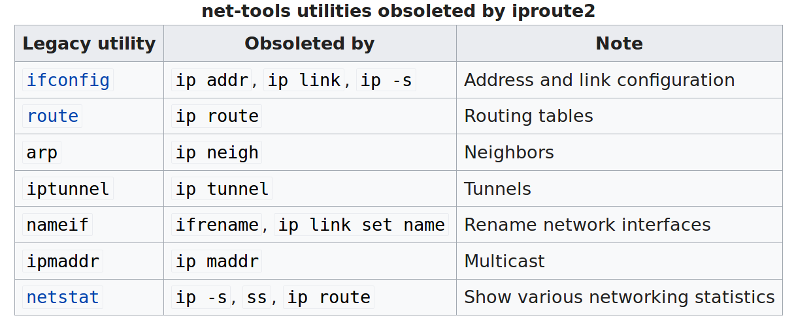

+++
title = "computer networking"
date = 2010-01-22T07:10:55+08:00
draft = false

# Tags and categories
# For example, use `tags = []` for no tags, or the form `tags = ["A Tag", "Another Tag"]` for one or more tags.
tags = ["NETWORK"]
categories = []

# Featured image
# To use, add an image named `featured.jpg/png` to your page's folder. 
[image]
  # Caption (optional)
  caption = ""

  # Focal point (optional)
  # Options: Smart, Center, TopLeft, Top, TopRight, Left, Right, BottomLeft, Bottom, BottomRight
  focal_point = ""
+++

# iproute2

# SCTP

transport-layer protocols are implemented in the end systems but not in network routers.

The Stream Control Transmission Protocol (SCTP) [RFC 4960, RFC 3286] is a reliable, message-oriented protocol that allows several different application-level “streams” to be multiplexed through a single SCTP connection (an approach known as “multi-streaming”). From a reliability standpoint, the different streams within the connection are handled separately, so that packet loss in one stream does not affect the delivery of data in other streams. QUIC provides similar multi-stream semantics. SCTP also allows data to be transferred over two outgoing paths when a host is connected to two or more networks, optional delivery of out-of-order data, and a number of other features. SCTP’s flow- and congestion-control algorithms are essentially the same as in TCP.

# tunnel

The tunneling protocol works by using the data portion of a packet (the payload) to carry the packets that actually provide the service. 

Typically, the delivery protocol operates at an equal or higher level in the layered model than the payload protocol.
As an example of network layer over network layer, Generic Routing Encapsulation (GRE), a protocol running over IP (IP protocol number 47), often serves to carry IP packets, with RFC 1918 private addresses, over the Internet using delivery packets with public IP addresses

# DHCP
In addition to host IP address assignment, DHCP also allows a host to learn additional information, such as its subnet mask, the address of its first-hop router (often called the default gateway), and the address of its local DNS server.

# link layer implement
Is a host’s link layer implemented in hardware or software? Is it implemented on a separate card or chip, and how does it interface with the rest of a host’s hardware and operating system components?
For the most part, the link layer is implemented  in  a  network  adapter,  also  sometimes  known  as  a  network  interface card (NIC). At the heart of the network adapter is the link-layer controller, usually a single, special-purpose chip that implements many of the link-layer services (framing, link access, error detection, and so on). Thus, much of a link-layer controller’s functionality is implemented in hardware

link-layer switches do not have link-layer addresses associated with their interfaces that connect to hosts and routers. This is because the job of the link-layer switch is to carry datagrams between hosts and routers; a switch does  this  job  transparently,  that  is,  without  the  host  or  router  having  to  explicitly address  the frame to the intervening switch

# MPLS

MPLS performs switching based on labels, without needing to consider the IP address of a packet. The true advantages of MPLS and the reason for current interest in MPLS, however, lie not in the potential increases in switching speeds, but rather in the new traffic management capabilities that MPLS enables.

MPLS provides the ability to forward packets along routes that would not be possible using standard IP routing protocols. This is one simple form of  traffic engineering  using MPLS

It can be used to perform fast restoration of MPLS forwarding paths, e.g., to reroute traffic over a precomputed failover path in response to link failure 
MPLS  can,  and  has,  been  used  to  implement  so-called virtual private networks  (VPNs). In implementing a VPN for a customer, an ISP uses its MPLS-enabled network to connect together the customer’s various networks. MPLS can be used to isolate both the resources and addressing used by the customer’s VPN from that of other users crossing the ISP’s network

# Why we use the Linux kernel's TCP stack

Since the Linux kernel cannot sustain the 10G packet rate, then some bypass technologies for a fast path are used. The main bypass technologies are either based on a limited set of features such as Open vSwitch (OVS) with its DPDK user space implementation or based on a full feature and offload of Linux processing such as 6WIND Virtual Accelerator.

https://events.static.linuxfound.org/sites/events/files/slides/2016%20-%20Linux%20Networking%20explained_0.pdf