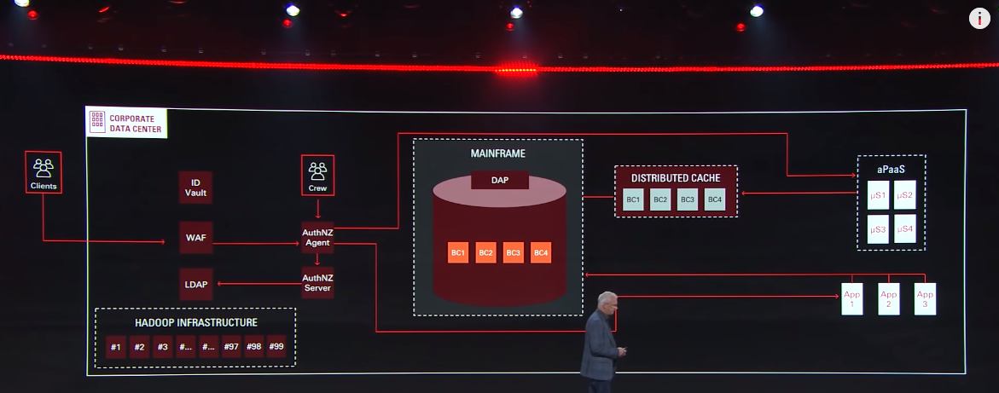
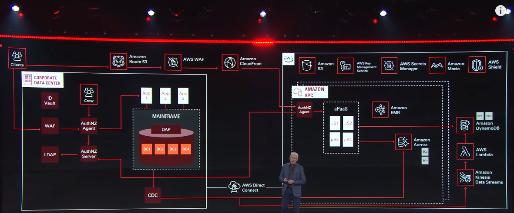
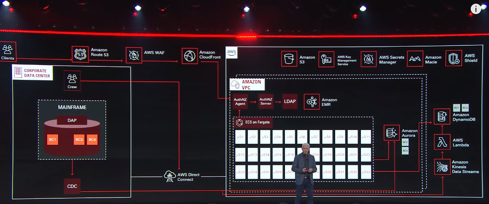
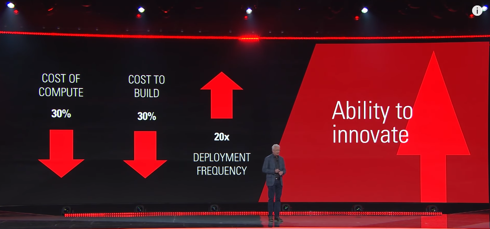

+++
title = "AWS Re:Invent 2019主题汇总-P1"
date = 2019-12-08T11:37:33+08:00
draft = false

# Tags and categories
# For example, use `tags = []` for no tags, or the form `tags = ["A Tag", "Another Tag"]` for one or more tags.
tags = ["AWS","CLOUD"]
categories = []

# Featured image
# To use, add an image named `featured.jpg/png` to your page's folder. 
[image]
  # Caption (optional)
  caption = ""

  # Focal point (optional)
  # Options: Smart, Center, TopLeft, Top, TopRight, Left, Right, BottomLeft, Bottom, BottomRight
  focal_point = ""
+++

## 计算

尽管函数计算和容器的快速崛起，EC2依然是AWS的业务焦点，

主要的新功能包括：

- 基于Nitro平台的针对HPC和机器学习的负载的实例

- 基于定制芯片Inferencia针对机器学习实例

- 标准实例支持100Gb网络带宽

## 网络

- 传输网关支持多播

- 加速的网络到网络的VPN链接

## 存储和数据分析

- S3 Access Points和数据湖

- ES搜索支持S3

- 联合查询支持关系数据库，REDSHIFT数据仓库，S3数据湖，而不需要移动数据

- AQUA查询加速器 

- 数据湖导出(REDSHIFT数据仓库查询结果能直接导出到S3，并以Parquet格式存放)

- 托管的Cassandra服务

## 函数计算

- [Provisioned Concurrency for Lambda Functions](/post/lambda-provisioned-concurrency/)

- EKS正式支持FARGATE

- RDS PROXY

- [VPC支持更新](/post/serverless-vpc)

## 先锋基金IT迁移架构图

*私有云架构包括4千万行的单体应用，hadoop数据仓库(20PB)和PaaS(2015年)*
*数据仓库和PaaS迁移到AWS*
*PaaS实施基于EDA架构的改造*
*PaaS迁移到Fargate*

