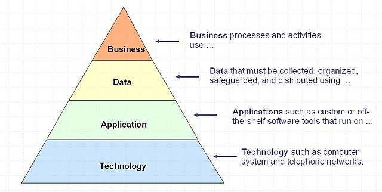
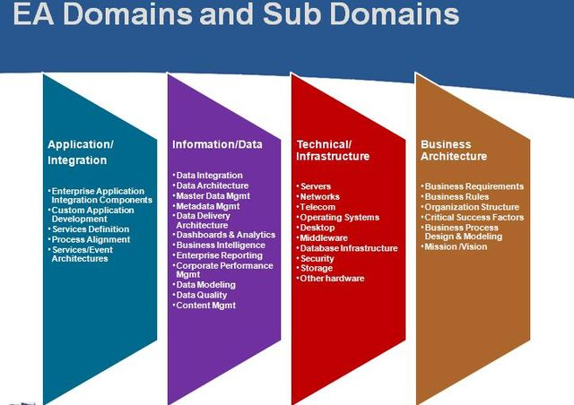

+++
title = "Enterprise Architecture Framework"
date = 2017-12-11T07:25:10+08:00
draft = false

# Tags and categories
# For example, use `tags = []` for no tags, or the form `tags = ["A Tag", "Another Tag"]` for one or more tags.
tags = ["EA", "ToGAF"]
categories = []

# Featured image
# To use, add an image named `featured.jpg/png` to your page's folder. 
[image]
  # Caption (optional)
  caption = ""

  # Focal point (optional)
  # Options: Smart, Center, TopLeft, Top, TopRight, Left, Right, BottomLeft, Bottom, BottomRight
  focal_point = ""
+++

## Architecture domain

Since Stephen Spewak's Enterprise Architecture Planning (EAP) in 1993, and perhaps before then, it has been normal to divide enterprises architecture into four architecture domains.

- Business architecture,
- Data architecture,
- Applications architecture,
- Technology architecture.

*Layers of the enterprise architecture*

