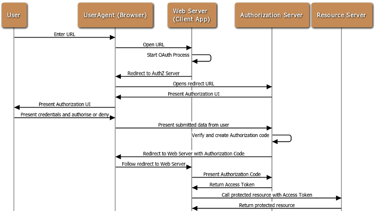

+++
title = "微服务认证和授权（MAA）指南"
date = 2019-04-28T17:08:07+08:00
tags = ["MICROSERVICE", "UAA"]
draft = false

# Tags and categories
# For example, use `tags = []` for no tags, or the form `tags = ["A Tag", "Another Tag"]` for one or more tags.

categories = []

# Featured image
# To use, add an image named `featured.jpg/png` to your page's folder. 
[image]
  # Caption (optional)
  caption = ""

  # Focal point (optional)
  # Options: Smart, Center, TopLeft, Top, TopRight, Left, Right, BottomLeft, Bottom, BottomRight
  focal_point = ""
+++


微服务认证和授权有很多方案，

这里比较各种主流方案的优缺点，

为你的业务系统选择MAA方案提供指南

方案 |  优点  | 缺点
:---|:--- |:---
分布式会话管理 |简单，成熟，服务器统一管理| 扩展性比较差 
客户令牌 || 
单点登录 ||
API网关令牌管理 || 
第三方应用授权 || 
SSL/TLS 双向认证 || 
 


# 方案

- 分布式会话管理

会话信息由服务器存储

实现方式：

1. Sticky session
2. Session replication
3. Centralized session storage

- 客户令牌

令牌由客户持有

JWT: 头，负载和签名

1. 头

```
{
"typ": "JWT",
"alg": "HS256"
}
```

2. 负载

```
{ 
"id": 123, 
"name": "hi tico",
"is_admin": true,
"expire": 1558213420 
}
```
3. 签名

```
HMACSHA256(
  base64UrlEncode(header) + "." +
  base64UrlEncode(payload),
  secret
)
```


- 单点登录


- API网关令牌管理


- 第三方应用授权

1. API 令牌

例如github的API个人令牌

2. OAUTH




Someone may wonder why an Authorization Code is used to request Access Token, rather than returning the Access Token to the client directly from the authorization server. The reason why OAuth is designed in this way is to pass through the user agent (browser) during the process of redirecting to the client’s Callback URL. If the Access Token is passed directly, there is a risk of being stolen.
 
By using the authorization code, the client directly interacts with the authorization server when applying for the access token, and the authorization server also authorize the client when processing the client’s token request, so it’s prevent others from forging the client’s identity to use the authentication code

- SSL/TLS 双向认证

例如istio citadel私有证书中心


[1]. https://medium.com/tech-tajawal/microservice-authentication-and-authorization-solutions-e0e5e74b248a