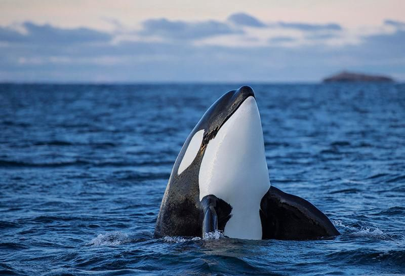

+++
title = "心理学家：21世纪最重要的工作技能"
date = 2019-10-12T16:19:59+08:00
draft = false

# Tags and categories
# For example, use `tags = []` for no tags, or the form `tags = ["A Tag", "Another Tag"]` for one or more tags.
tags = []
categories = []

# Featured image
# To use, add an image named `featured.jpg/png` to your page's folder. 
[image]
  # Caption (optional)
  caption = ""

  # Focal point (optional)
  # Options: Smart, Center, TopLeft, Top, TopRight, Left, Right, BottomLeft, Bottom, BottomRight
  focal_point = ""
+++

心理学家：21世纪最重要的工作技能

专注是21世纪最重要的工作技能，

可是很多人没有意识到这一点。

1971年的时候心理学家[西蒙](https://www0.gsb.columbia.edu/mygsb/faculty/research/pubfiles/5625/dessein_rational.pdf)就说过：“大量的信息

意味着另一种东西变得很稀缺：注意力”。 几十年之前这是个事实，

在21世纪，注意力变的更加珍贵。

工作环境正在发生快速的变化，在不远的将来，

在这个世界只存在两种人：

- 一种注意力被别人完全控制和操纵的人

- 一种注意力不可被打扰的人

研究人员告诉我们专注和注意力人们创新发展的原材料

下面是一些常见的工作干扰：

- 聊天群

- 会议

- 电话

- 邮件

- 同事

