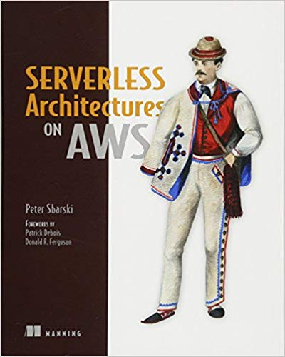

+++
title = "书籍推荐:无服务器架构及应用案例详解"
date = 2018-01-30T11:43:11+08:00
draft = false

# Tags and categories
# For example, use `tags = []` for no tags, or the form `tags = ["A Tag", "Another Tag"]` for one or more tags.
tags = ["SERVERLESS"]
categories = []

# Featured image
# To use, add an image named `featured.jpg/png` to your page's folder. 
[image]
  # Caption (optional)
  caption = ""

  # Focal point (optional)
  # Options: Smart, Center, TopLeft, Top, TopRight, Left, Right, BottomLeft, Bottom, BottomRight
  focal_point = ""
+++


[Serverless Architectures](https://www.amazon.com/dp/1617293822/ref=rdr_ext_tmb)

[](https://www.amazon.com/dp/1617293822/ref=rdr_ext_tmb)

```
ISBN-10: 1617293822
```