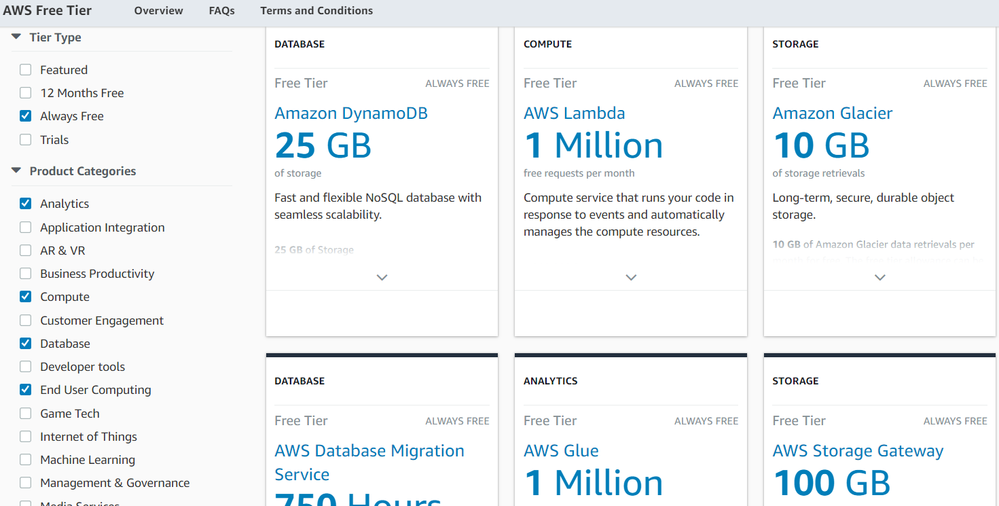

+++
title = "AWS云服务每月免费额度列表"
date = 2017-11-30T17:51:29+08:00
draft = false

# Tags and categories
# For example, use `tags = []` for no tags, or the form `tags = ["A Tag", "Another Tag"]` for one or more tags.
tags = ["AWS"]
categories = []

# Featured image
# To use, add an image named `featured.jpg/png` to your page's folder. 
[image]
  # Caption (optional)
  caption = ""

  # Focal point (optional)
  # Options: Smart, Center, TopLeft, Top, TopRight, Left, Right, BottomLeft, Bottom, BottomRight
  focal_point = ""
+++

## S3

The S3 free tier allows users to store 5 GB of data with standard storage, issue

20,000 GET requests and 2,000 PUT requests, and transfer 15 GB of data out each

month

## LAMBDA

Lambda provides a free tier with 1M free requests and 400,000 GB-seconds of

compute time