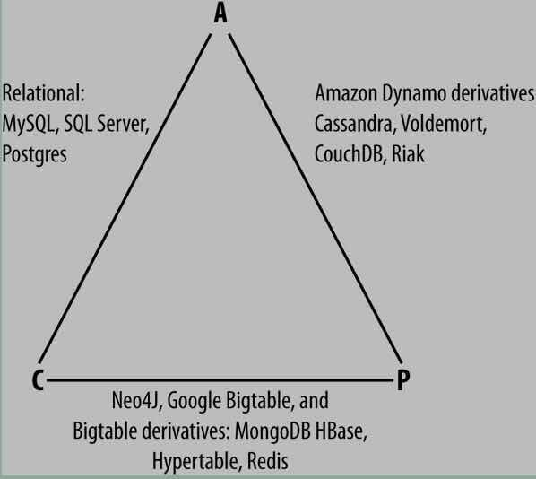

+++
title = "Cassandra"
date = 2017-04-28T17:08:07+08:00
tags = ["SHELL", "NOSQL"]
draft = false

# Tags and categories
# For example, use `tags = []` for no tags, or the form `tags = ["A Tag", "Another Tag"]` for one or more tags.

categories = []

# Featured image
# To use, add an image named `featured.jpg/png` to your page's folder. 
[image]
  # Caption (optional)
  caption = ""

  # Focal point (optional)
  # Options: Smart, Center, TopLeft, Top, TopRight, Left, Right, BottomLeft, Bottom, BottomRight
  focal_point = ""
+++


# 特性

- 与hadoop集成，支持MR数据读取
- 二级索引
- 支持长行（最多20亿的列）
- 动态schema更改
- bulk load 其他数据源如hadoop with sstableloader， CSV importing with cqlsh
- DTCS优化时序数据性能


# DB CATEGORY BY CAP



- CA 

To primarily support consistency and availability means that you’re likely using two-phase commit for distributed transactions. It means that the system will block when a network partition occurs, so it may be that your system is limited to a single data center cluster in an attempt to mitigate this. If your application needs only this level of scale, this is easy to manage and allows you to rely on familiar, simple structures.

- CP 

To primarily support consistency and partition tolerance, you may try to advance your architecture by setting up data shards in order to scale. Your data will be consistent, but you still run the risk of some data becoming unavailable if nodes fail.

- AP

 To primarily support availability and partition tolerance, your system may return inaccurate data, but the system will always be available, even in the face of network partitioning. DNS is perhaps the most popular example of a system that is massively scalable, highly available, and partition tolerant.


```
 Cassandra uses a special primary key called a 
 composite key (or compound key) to represent wide 
 rows, also called partitions. The composite key 
 consists of a partition key, plus an optional set
of clustering columns. The partition key is used
to determine the nodes on which rows are stored
 and can itself consist of multiple columns.

 The clustering columns are used to control how data
  is sorted for storage within a partition.
Cassandra also supports an additional construct
 called a static column, which is for storing data 
 that is not part of the primary key but is shared
  by every row in a partition
```


# Server-Side Denormalization with Materialized Views

Historically, denormalization in Cassandra has required designing
and managing multiple tables using techniques we will introduce
momentarily. Beginning with the 3.0 release, Cassandra provides a
feature known as materialized views which allows us to create multiple
denormalized views of data based on a base table design. Cassandra
manages materialized views on the server, including the
work of keeping the views in sync with the table

Materialized views simplify application development: instead of the application having to
keep multiple denormalized tables in sync, Cassandra takes on the responsibility of
updating views in order to keep them consistent with the base table


# Primary Keys Are Forever

After you create a table, there is no way to modify the primary key, because this controls how data is distributed within the cluster, and even more importantly, how it is stored on disk.

