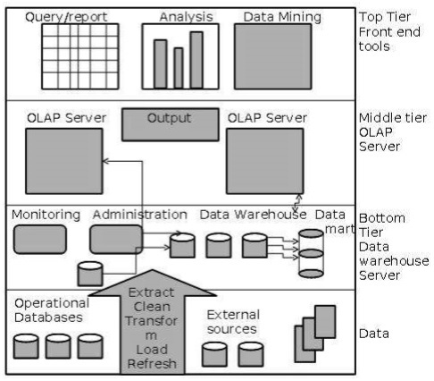
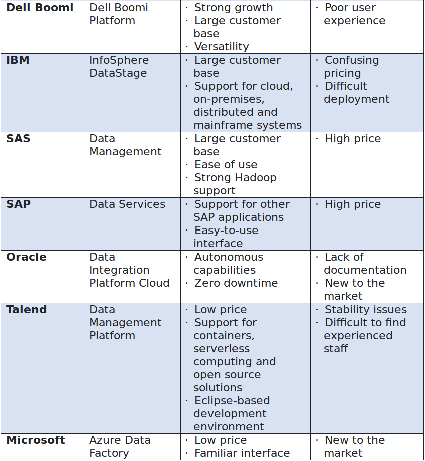

+++
title = "数据仓库"
date = 2015-03-11T10:18:35+08:00
draft = false

# Tags and categories
# For example, use `tags = []` for no tags, or the form `tags = ["A Tag", "Another Tag"]` for one or more tags.
tags = ["DATAWAREHOUSE", "OLAP", "ETL"]
categories = []

# Featured image
# To use, add an image named `featured.jpg/png` to your page's folder. 
[image]
  # Caption (optional)
  caption = ""

  # Focal point (optional)
  # Options: Smart, Center, TopLeft, Top, TopRight, Left, Right, BottomLeft, Bottom, BottomRight
  focal_point = ""
+++

# cloud data management

https://dataschool.com/data-governance

# 三层数据仓库架构

Generally a data warehouses adopts a three-tier architecture. Following are the three tiers of the data warehouse architecture.

  - Bottom Tier − The bottom tier of the architecture is the data warehouse database server. It is the relational database system. We use the back end tools and utilities to feed data into the bottom tier. These back end tools and utilities perform the Extract, Clean, Load, and refresh functions.

  - Middle Tier − In the middle tier, we have the OLAP Server that can be implemented in either of the following ways.
  
  - Top-Tier − This tier is the front-end client layer. This layer holds the query tools and reporting tools, analysis tools and data mining tools.

# Star schema vs. Snowflake Schema

||Star Schema	| Snowflake Schema
:---|:---|:---
Understandability |	Easier for business users and analysts to query data|	Maybe more difficult for business users and analysts due to a number of tables they have to deal with
Dimension table|Only has one dimension table for each dimension that groups related attributes. Dimension tables are not in the third normal form|May have more than 1 dimension table for each dimension due to the further normalization of each dimension table.  Dimension tables are in the third normal form (3NF)
Query complexity|The query is very simple and easy to understand|More complex query due to multiple foreign keys joins between dimension tables
Query performance|High performance. The database engine can optimize and boost the query performance based on a predictable framework|More foreign key joins, therefore, longer execution time of query in compare with star schema 
When to use|When dimension tables store a relatively small number of rows, space is not a big issue we can use star schema|When dimension tables store a large number of rows with redundancy data and space is such an issue, we can choose snowflake schema to save space.
Foreign Key Joins|Fewer Joins	|Higher number of joins
Data warehouse system|	Work best in any data warehouse/data mart	|Better for small data warehouse/ data mart

# ETL工具

Vendor|ETL Product|Strengths|Weaknesses
:---|:---|:---|:---
Informatica |Data Integration Platform| Highly rated by analystsExtensive product portfolio|Reputation for high prices Overlapping products

# 基本概念

- dimensions vs facts

It may help to think of dimensions as things or objects. A thing such as a product can exist without ever being involved in a business event. A dimension is your noun. It is something that can exist independent of a business event, such as a sale. Products, employees, equipment, are all things that exist. A dimension either does something, or has something done to it.

Employees sell, customers buy. Employees and customers are examples of dimensions, they do.

Products are sold, they are also dimensions as they have something done to them.

Facts, are the verb. An entry in a fact table marks a discrete event that happens to something from the dimension table. A product sale would be recorded in a fact table. The event of the sale would be noted by what product was sold, which employee sold it, and which customer bought it. Product, Employee, and Customer are all dimensions that describe the event, the sale.

In addition fact tables also typically have some kind of quantitative data. The quantity sold, the price per item, total price, and so on.

