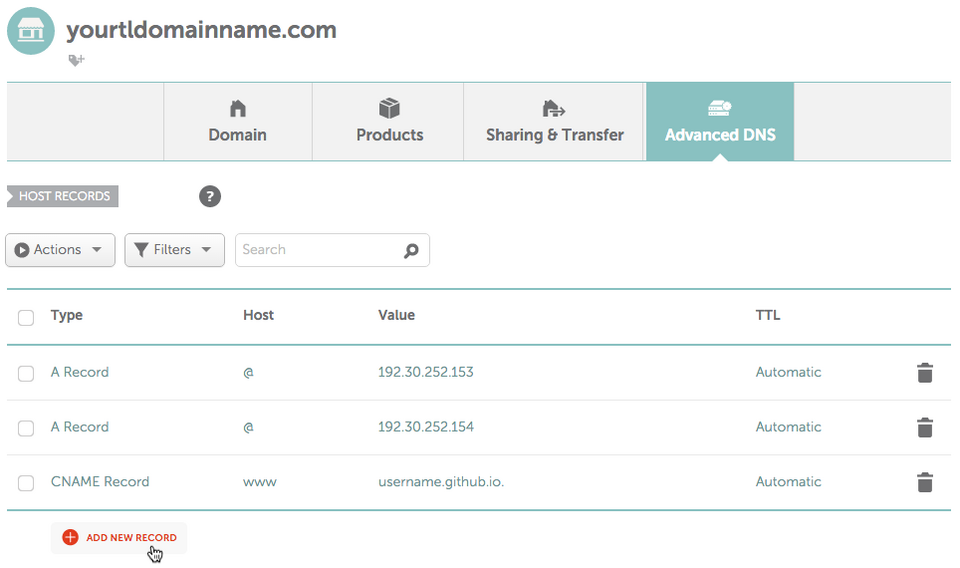

+++
title = "DNS配置Github Pages"
date = 2017-02-25T12:51:44+08:00
draft = false

# Tags and categories
# For example, use `tags = []` for no tags, or the form `tags = ["A Tag", "Another Tag"]` for one or more tags.
tags = ["DNS","GITHUB"]
categories = []

# Featured image
# To use, add an image named `featured.jpg/png` to your page's folder. 
[image]
  # Caption (optional)
  caption = ""

  # Focal point (optional)
  # Options: Smart, Center, TopLeft, Top, TopRight, Left, Right, BottomLeft, Bottom, BottomRight
  focal_point = ""
+++


**Namecheap不支持根域(apex doamin/naked domain/bare domain)的ALIAS记录**


# 在代码仓库的根目录创建CNAME文件

`CNME`文件包括根域域名

```
tee CNAME << EOF
wubigo.com
EOF
```

# 在DNS控制台创建域名记录 

一条指向根域的A记录，一条指向子域的CNAME记录
AN A Record for @(apex doamin) and a cname record(Alias) for github


**不要在github页使用通配符 dns 记录! 否则没有指定的子域将有被别人使用的风险**

# 确认域名配置成功

```
dig www.wubigo.com +nostats +nocomments +nocmd

; <<>> DiG 9.10.3-P4-Ubuntu <<>> www.wubigo.com +nostats +nocomments +nocmd
;; global options: +cmd
;www.wubigo.com.			IN	A
www.wubigo.com.		1	IN	CNAME	wubigo.github.io.
wubigo.github.io.	3462	IN	A	185.199.111.153
wubigo.github.io.	3462	IN	A	185.199.110.153
wubigo.github.io.	3462	IN	A	185.199.109.153
wubigo.github.io.	3462	IN	A	185.199.108.153

```