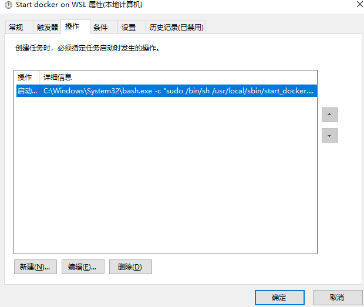

+++
title = "在WSL中使用Docker"
date = 2019-10-08T14:21:19+08:00
draft = false

# Tags and categories
# For example, use `tags = []` for no tags, or the form `tags = ["A Tag", "Another Tag"]` for one or more tags.
tags = ["DOCKER", "WINDOWS"]
categories = []

# Featured image
# To use, add an image named `featured.jpg/png` to your page's folder. 
[image]
  # Caption (optional)
  caption = ""

  # Focal point (optional)
  # Options: Smart, Center, TopLeft, Top, TopRight, Left, Right, BottomLeft, Bottom, BottomRight
  focal_point = ""
+++


在windows中使用docker有多种方式：

- docker WIN10 desktop

- WSL

本文主要介绍在WSL中使用docker

# 前提条件

- Windows 10 Version 1803以上(支持cgroups)

- Ubuntu for WSL 16.0.4 LTS(WSL支持的最新版本)

- Docker 17.09

# 安装WSL

[install WSL](https://docs.microsoft.com/en-us/windows/wsl/install-win10)

# WSL 命令行和默认 shell


```
cmd:\>wsl
wubigo:/tmp/docker-desktop-root/mnt/host/d/code#/etc# cat /etc/wsl.conf
[automount]
root = /mnt/host
crossDistro = true
options = "metadata"
```

# WSL DOCKER磁盘卷路径

```
cmd:\>docker volume inspect edgex_consul-config
[
    {
        "CreatedAt": "2022-03-07T08:04:34Z",
        "Driver": "local",
        "Labels": {
            "com.docker.compose.project": "edgex",
            "com.docker.compose.version": "2.2.3",
            "com.docker.compose.volume": "consul-config"
        },
        "Mountpoint": "/var/lib/docker/volumes/edgex_consul-config/_data",
        "Name": "edgex_consul-config",
        "Options": null,
        "Scope": "local"
    }
]
```


`\\wsl$\docker-desktop-data\version-pack-data\community\docker\volumes\`


# 安装Ubuntu for WSL 16.0.4 LTS

[install ubuntu in WSL](https://docs.microsoft.com/en-us/windows/wsl/install-manual)

# 安装DOCKER

- 启动ubuntu in WSL(以管理员身份运行)

```
c:\>wsl -d Ubuntu-16.04
```

- 安装docker

```
$ curl -fsSL https://download.docker.com/linux/ubuntu/gpg | sudo apt-key add -
$ sudo add-apt-repository "deb [arch=amd64] https://download.docker.com/linux/ubuntu $(lsb_release -cs) stable"
$ sudo apt-get install docker-ce=17.09.0~ce-0~ubuntu
$ sudo usermod -aG docker $USER
```

- 启动docker服务

`/usr/local/sbin/start_docker.sh`

```
#!/usr/bin/env bash
sudo cgroupfs-mount
sudo service docker start
```

# 在系统启动的时候运行docker服务

在**控制面版\管理工具\计划任务**创建任务




操作的参数如下：

```
-c "sudo /bin/sh /usr/local/sbin/start_docker.sh"
```

# 备份WSL

**在备份前保存并关闭所有的WSL进程，否则正在运行的进程被强行关闭**

```
c:\>wsl -l
c:\>wsl --export Ubuntu-16.04 Ubuntu-16.wsl.export.tar
```


# 升级linux

```
d:\code\dapp>wsl -l -v
  NAME                   STATE           VERSION
* Ubuntu                 Running         1
  docker-desktop         Running         2
  docker-desktop-data    Running         2
```

升级Ubuntu  从WSL 1 到2

```
wsl --set-version Ubuntu 2

d:\code\dapp>wsl -l -v
  NAME                   STATE           VERSION
* Ubuntu                 Stopped         2
  docker-desktop         Running         2
  docker-desktop-data    Running         2
```


# WSL localhost connection refused


运行之前先备份`/etc/hosts`

`wsl2-ubuntu-map-win-localhost.sh`

```
nameserver=$(grep -m 1 nameserver /etc/resolv.conf | awk '{print $2}')   # find nameserver
[ -n "$nameserver" ] || "unable to find nameserver" || exit 1            # exit immediately if nameserver was not found
echo "##### nameserver found: '$nameserver'"
localhost_entry=$(grep -v "127.0.0.1" /etc/hosts | grep "\slocalhost$")  # find localhost entry excluding 127.0.0.1
if [ -n "$localhost_entry" ]; then                                       # if localhost entry was found
    echo "##### localhost entry found: '$localhost_entry'"
    sed -i "s/$localhost_entry/$nameserver localhost/g" /etc/hosts       # then update localhost entry with the new $nameserver
else                                                                     # else if entry was not found
    echo "##### localhost entry not found"
    echo "$nameserver localhost" >> /etc/hosts                           # then append $nameserver mapping to localhost
fi
cat /etc/hosts                                              
```

https://gist.github.com/toryano0820/6ee3bff2474cdf13e70d972da710996a#:~:text=For%20WSL2%3A%20Fixes%20%22Connection%20Refused%22%20issue%20when%20accessing,Remember%20to%20backup%20%22%2Fetc%2Fhosts%22%20just%20in%20case%20%21%21%21


# 在windows访问wsl文件系统

```
\\wsl$
```


REF

[1](https://medium.com/faun/docker-running-seamlessly-in-windows-subsystem-linux-6ef8412377aa)


#  静态IP


`WSL-ip.bat`

```
wsl -d Ubuntu -u root ip addr add 192.168.50.16/24 broadcast 192.168.50.255 dev eth0 label eth0:1

netsh interface ip add address "vEthernet (WSL)" 192.168.50.88 255.255.255.0
```

https://lifesaver.codes/answer/static-ip-on-wsl-2-418

