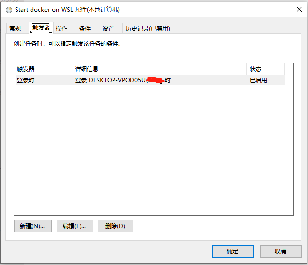

+++
title = "在WSL中使用Docker"
date = 2019-10-08T14:21:19+08:00
draft = false

# Tags and categories
# For example, use `tags = []` for no tags, or the form `tags = ["A Tag", "Another Tag"]` for one or more tags.
tags = ["DOCKER", "WINDOWS"]
categories = []

# Featured image
# To use, add an image named `featured.jpg/png` to your page's folder. 
[image]
  # Caption (optional)
  caption = ""

  # Focal point (optional)
  # Options: Smart, Center, TopLeft, Top, TopRight, Left, Right, BottomLeft, Bottom, BottomRight
  focal_point = ""
+++


在windows中使用docker有多种方式：

- docker WIN10 desktop

- WSL

本文主要介绍在WSL中使用docker

# 前提条件

- Windows 10 Version 1803以上(支持cgroups)

- Ubuntu for WSL 16.0.4 LTS(WSL支持的最新版本)

- Docker 17.09

# 安装WSL

[install WSL](https://docs.microsoft.com/en-us/windows/wsl/install-win10)

# 安装Ubuntu for WSL 16.0.4 LTS

[install ubuntu in WSL](https://docs.microsoft.com/en-us/windows/wsl/install-manual)

# 安装DOCKER

- 启动ubuntu in WSL(以管理员身份运行)

```
c:\>wsl -d Ubuntu-16.04
```

- 安装docker

```
$ curl -fsSL https://download.docker.com/linux/ubuntu/gpg | sudo apt-key add -
$ sudo add-apt-repository "deb [arch=amd64] https://download.docker.com/linux/ubuntu $(lsb_release -cs) stable"
$ sudo apt-get install docker-ce=17.09.0~ce-0~ubuntu
$ sudo usermod -aG docker $USER
```

- 启动docker服务

`/usr/local/sbin/start_docker.sh`

```
#!/usr/bin/env bash
sudo cgroupfs-mount
sudo service docker start
```

# 在系统启动的时候运行docker服务

在**控制面版\管理工具\计划任务**创建任务




操作的参数如下：

```
-c "sudo /bin/sh /usr/local/sbin/start_docker.sh"
```

# 备份WSL

**在备份前保存并关闭所有的WSL进程，否则正在运行的进程被强行关闭**

```
c:\>wsl -l
c:\>wsl --export Ubuntu-16.04 Ubuntu-16.wsl.export.tar
```

REF

[1](https://medium.com/faun/docker-running-seamlessly-in-windows-subsystem-linux-6ef8412377aa)