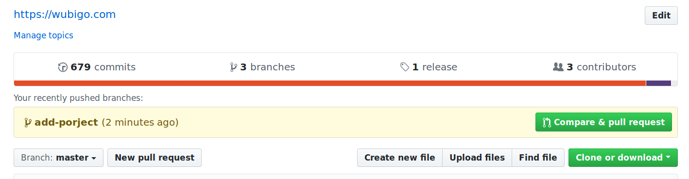
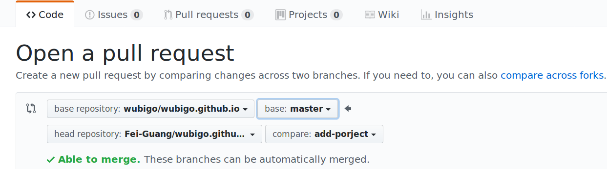

+++
title = "分叉拉取模式(fork and pull model)"
date = 2017-03-04T08:06:21+08:00
draft = false

# Tags and categories
# For example, use `tags = []` for no tags, or the form `tags = ["A Tag", "Another Tag"]` for one or more tags.
tags = ["GIT", "SCM"]
categories = []

# Featured image
# To use, add an image named `featured.jpg/png` to your page's folder. 
[image]
  # Caption (optional)
  caption = ""

  # Focal point (optional)
  # Options: Smart, Center, TopLeft, Top, TopRight, Left, Right, BottomLeft, Bottom, BottomRight
  focal_point = ""
+++

GITHUB两种主要的pull request的开发模式

# 分叉拉取模式

任何开发人员可以在项目源仓库(upstream)分叉，然后仓库该分叉(origin)到本地文件系统进行开发
测试，测试完毕提交到分叉origin，并发送pull request到源仓库upstream, 源仓库维护人员评审
更改，并最终决定是否合并该更改到源仓库

在发送pull request之前，好几个开发人员共同为一个特性协作开发， 互相从对方的仓库拉取代码。
这时，从对方的仓库拉取代码简化重新定义一个remote，该remote把本地的分叉指向对方仓库地址。


>https://github.com/wubigo/wubigo.github.io 单击Fork按钮(右上角)

GITHUB把该仓库代码复制到自己的github账号，建立分叉仓库

  + 打开git命令行客户端，把分叉仓库克隆到本地环境

```
git clone https://github.com/$USER_NAME/wubigo.github.io.git
cd wubigo.github.io
git remote add upstream git@github.com:wubigo/wubigo.github.io.git
# Never push to upstream master
git remote set-url --push upstream no_push
# Confirm that your remotes make sense:
git remote -v
origin	https://github.com/Fuang/wubigo.github.io.git (fetch)
origin	https://github.com/Fuang/wubigo.github.io.git (push)
upstream	git@github.com:wubigo/wubigo.github.io.git (fetch)
upstream	git@github.com:wubigo/wubigo.github.io.git (push)
```

+ 同步本地代码到upstream

```
git fetch upstream
git checkout master
git rebase upstream/master
git push
```

+ 查看各个分支的最新提交ID

```
git branch -av

* master                  a3b4a2b Update 2016-02-03-k8s local development setup.md
  remotes/origin/HEAD     -> origin/master
  remotes/origin/jekyll   439d951 Merge branch 'master' of github.com:wubigo/igo.github.io
  remotes/origin/master   a3b4a2b Update 2016-02-03-k8s local development setup.md
  remotes/upstream/jekyll 439d951 Merge branch 'master' of github.com:wubigo/igo.github.io
  remotes/upstream/master a38ea93 deploy:github fork&pull model
```

+ 从分叉创建pull request 

原则上你可以在你分叉的任何分支或提交ID上向upstream仓库发出pull request， 
但实际开发中，建议自建主题分支。

```
git branch add-project
git add .
git commit -m "add project"
git push

```

+ 进入github页面



点击add-project分支后面的compare & pull request按钮



确认base repo是upstream， head repo是分叉

compare分支选择自建的add-project


