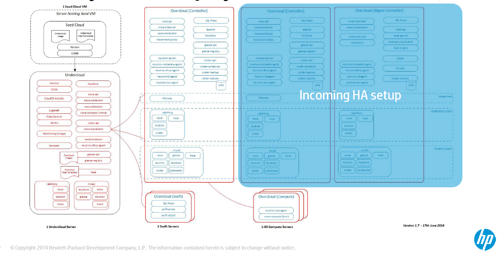
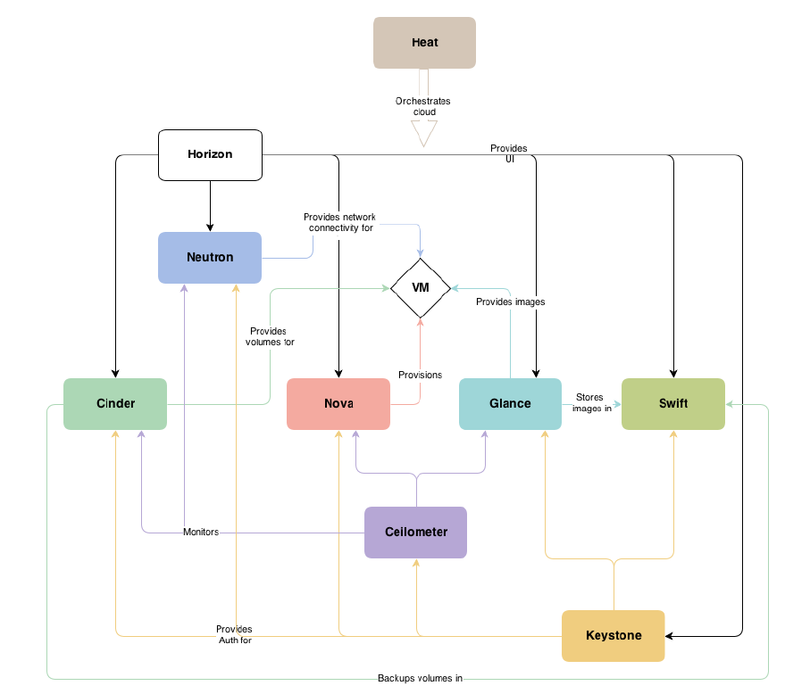
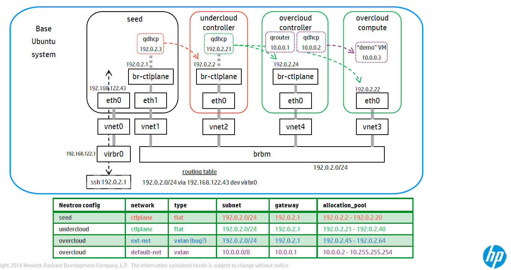
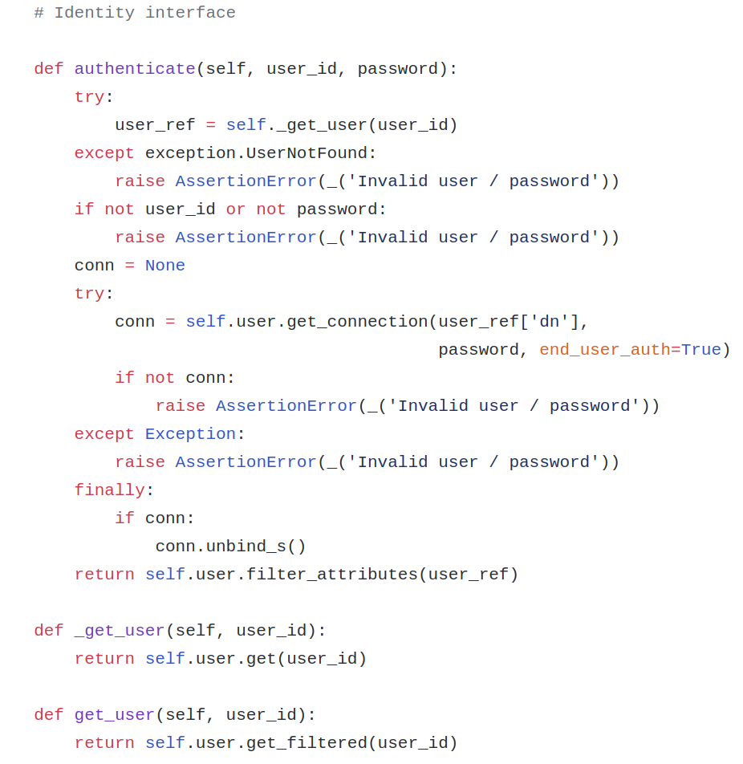
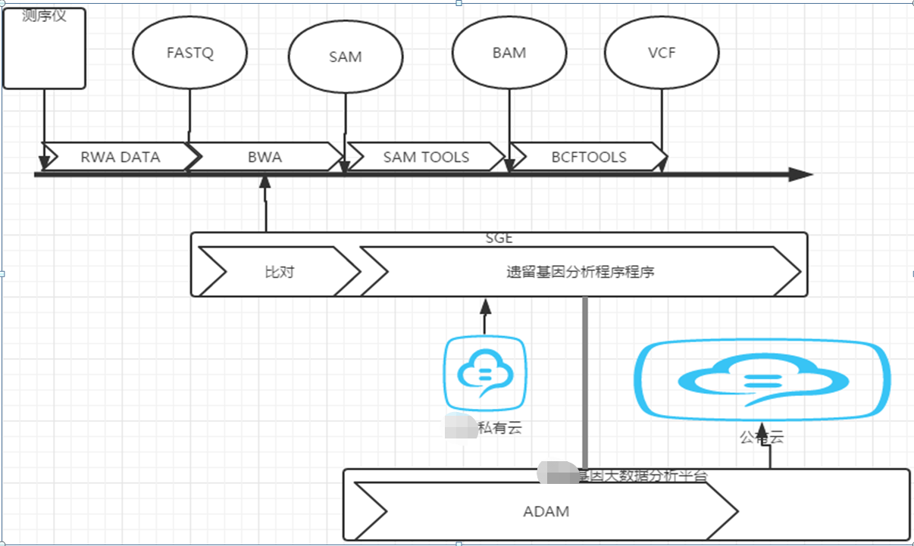
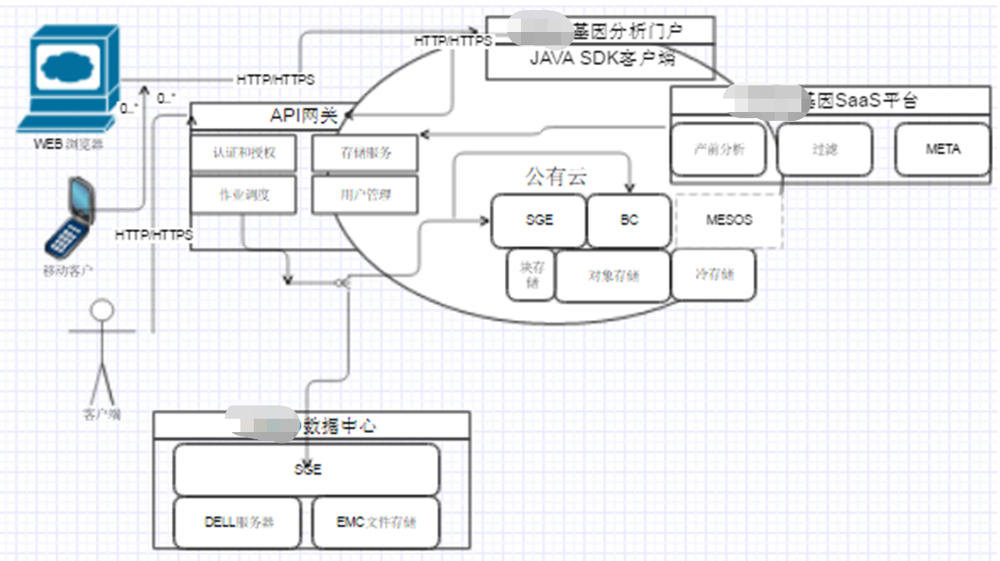
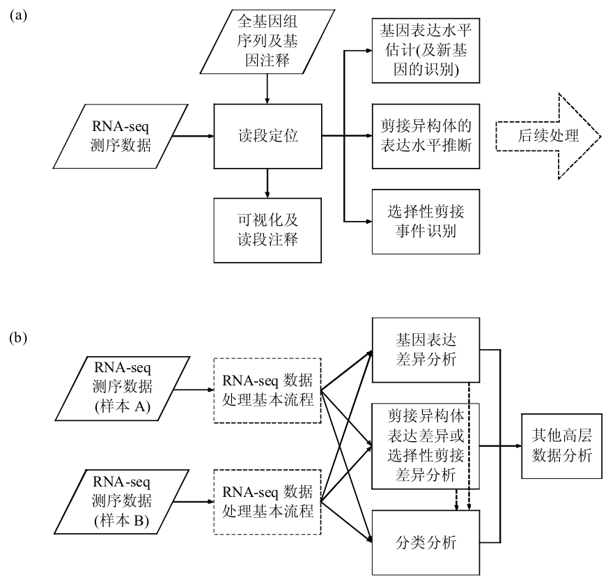
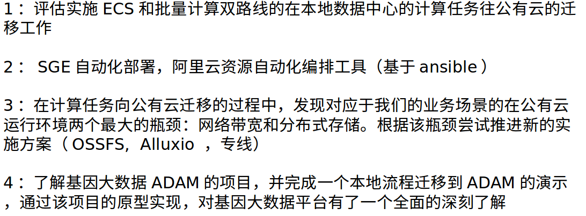
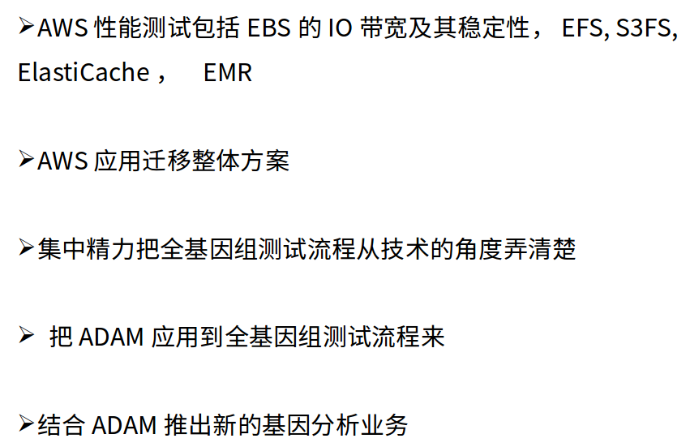
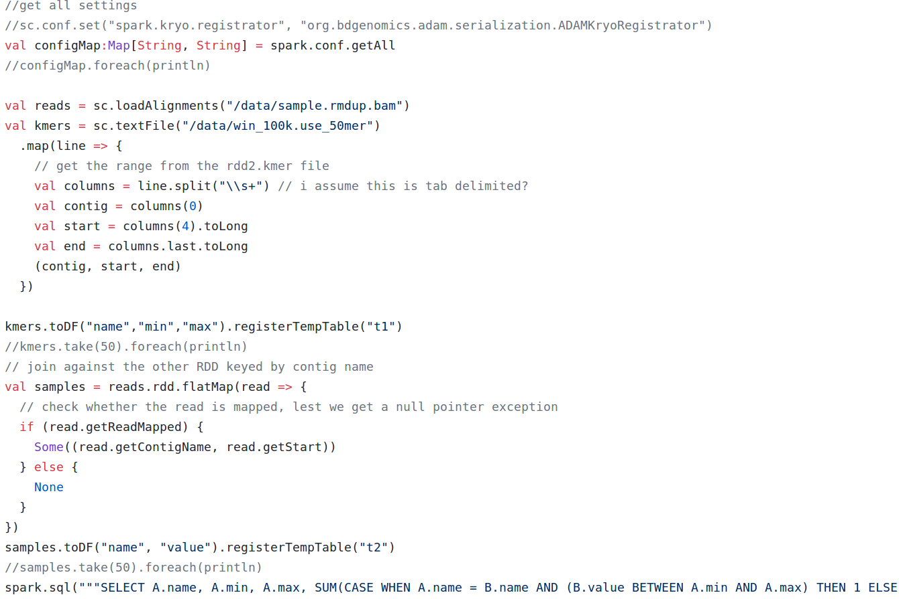

+++
title = "Hpcloud Notes"
date = 2011-03-24T17:53:35+08:00
draft = false

# Tags and categories
# For example, use `tags = []` for no tags, or the form `tags = ["A Tag", "Another Tag"]` for one or more tags.
tags = ["IAAS"]
categories = []

# Featured image
# To use, add an image named `featured.jpg/png` to your page's folder. 
[image]
  # Caption (optional)
  caption = ""

  # Focal point (optional)
  # Options: Smart, Center, TopLeft, Top, TopRight, Left, Right, BottomLeft, Bottom, BottomRight
  focal_point = ""
+++

# 惠普混合云

惠普tripleO整体方案

惠普混合云主要模块

网络控制节点

授权认证部分源代码

# 医疗数据分析

- 医疗数据某业务流程

- 医疗数据处理图

- 医疗项目部分工作内容

`部分任务`

`部分任务`

`部分源代码`

