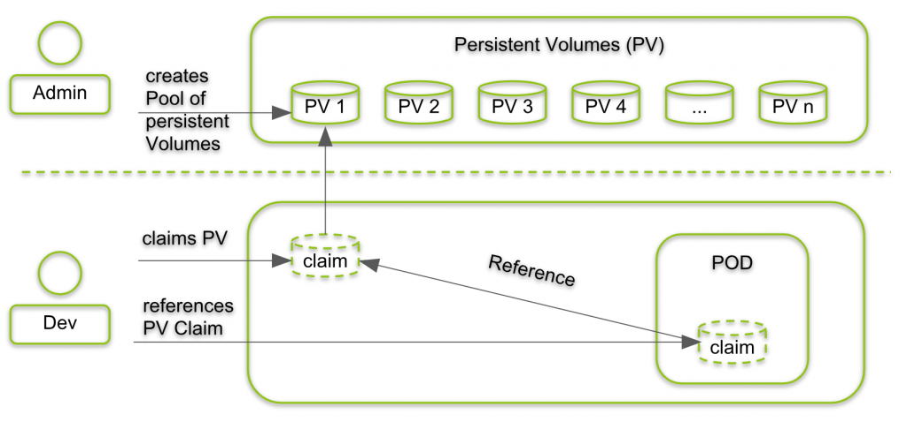

+++
title = "K8S CSI"
date = 2018-02-24T06:55:53+08:00
draft = false

# Tags and categories
# For example, use `tags = []` for no tags, or the form `tags = ["A Tag", "Another Tag"]` for one or more tags.
tags = ["STORAGE", "K8S", "CSI"]
categories = []

# Featured image
# To use, add an image named `featured.jpg/png` to your page's folder. 
[image]
  # Caption (optional)
  caption = ""

  # Focal point (optional)
  # Options: Smart, Center, TopLeft, Top, TopRight, Left, Right, BottomLeft, Bottom, BottomRight
  focal_point = ""
+++

# PersistentVolume

A PersistentVolume (PV) is a piece of storage in the cluster that has been manually provisioned by an administrator, or dynamically provisioned by Kubernetes using a StorageClass. Many cluster environments have a default StorageClass installed. When a StorageClass is not specified in the PersistentVolumeClaim, the cluster’s default StorageClass is used instead

Local volumes can only be used as a statically created PersistentVolume. Dynamic provisioning is not supported yet

In local clusters, the default StorageClass uses the hostPath provisioner. hostPath volumes are only suitable for development and testing. With hostPath volumes, the data lives in /tmp on the node the Pod is scheduled onto and does not move between nodes

# Provisioning

There are two ways PVs may be provisioned: statically or dynamically.

- Static

A cluster administrator creates a number of PVs. They carry the details of the real storage which is available for use by cluster users. They exist in the Kubernetes API and are available for consumption.

- Dynamic

When none of the static PVs the administrator created matches a user’s PersistentVolumeClaim, the cluster may try to dynamically provision a volume specially for the PVC. This provisioning is based on StorageClasses: the PVC must request a storage class and the administrator must have created and configured that class in order for dynamic provisioning to occur. Claims that request the class "" effectively disable dynamic provisioning for themselves.

To enable dynamic storage provisioning based on storage class, the cluster administrator needs to enable the DefaultStorageClass admission controller on the API server. This can be done, for example, by ensuring that DefaultStorageClass is among the comma-delimited, ordered list of values for the --enable-admission-plugins flag of the API server component. For more information on API server command line flags, please check kube-apiserver documentation.

