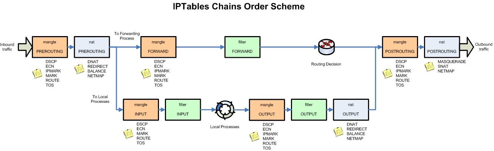

+++
title = "linux note"
date = 2012-06-03T19:39:03+08:00
draft = false

# Tags and categories
# For example, use `tags = []` for no tags, or the form `tags = ["A Tag", "Another Tag"]` for one or more tags.
tags = ["IAAS", "LINUX"]
categories = ["IT"]

# Featured image
# To use, add an image named `featured.jpg/png` to your page's folder. 
[image]
  # Caption (optional)
  caption = ""

  # Focal point (optional)
  # Options: Smart, Center, TopLeft, Top, TopRight, Left, Right, BottomLeft, Bottom, BottomRight
  focal_point = ""
+++

# iptables规则配置


- 表与链


- 调用链顺序
  
  

# 检查内存

ram speed and type

- dmidecode

```
sudo dmidecode --type memory

# dmidecode 3.0
Getting SMBIOS data from sysfs.
SMBIOS 2.6 present.

Handle 0x003E, DMI type 17, 28 bytes
Memory Device
	Array Handle: 0x003C
	Error Information Handle: Not Provided
	Total Width: Unknown
	Data Width: Unknown
	Size: No Module Installed
	Form Factor: DIMM
	Set: 1
	Locator: XMM1
	Bank Locator: Not Specified
	Type: DDR3
	Type Detail: Synchronous
	Speed: Unknown
	Manufacturer: JEDEC ID:
	Serial Number:  
	Asset Tag: Not Specified
	Part Number:  
	Rank: Unknown


```

- lshw
  
```
sudo lshw -class memory


memory:0
       description: System Memory
       physical id: 3c
       slot: System board or motherboard
     *-bank:0
          description: DIMM DDR3 Synchronous [empty]
          vendor: JEDEC ID:
          physical id: 0
          slot: XMM1
     *-bank:1
          description: DIMM DDR3 Synchronous 1333 MHz (0.8 ns)
          product: M378B5273DH0-CH9
          vendor: JEDEC ID:80 CE
          physical id: 1
          serial: D3894765
          slot: XMM2
          size: 4GiB
          width: 64 bits
          clock: 1333MHz (0.8ns)
     *-bank:2
          description: DIMM DDR3 Synchronous 1333 MHz (0.8 ns)
          product: M378B5273DH0-CH9
          vendor: JEDEC ID:80 CE
          physical id: 2
          serial: D4894765
          slot: XMM3
          size: 4GiB
          width: 64 bits
          clock: 1333MHz (0.8ns)
     *-bank:3
          description: DIMM DDR3 Synchronous 1333 MHz (0.8 ns)
          product: 8JTF12864AZ-1G4G1
          vendor: JEDEC ID:80 2C
          physical id: 3
          serial: 07572436
          slot: XMM4
          size: 1GiB
          width: 64 bits
          clock: 1333MHz (0.8ns)


```

2R*8 代表双面，每面（RANK）8个芯片颗粒


# download manager

```
sudo apt-get install uget
uget-gtk
```

#  Enables forwarding of the authentication agent connection

- client config `.ssh/config`

```
ForwardAgent  yes
```

- Enable ssh-agent on main device

`.bashrc`

```
SSH_ENV="$HOME/.ssh/environment"

function start_agent {
    echo "Initialising new SSH agent..."
    /usr/bin/ssh-agent | sed 's/^echo/#echo/' > "${SSH_ENV}"
    echo succeeded
    chmod 600 "${SSH_ENV}"
    . "${SSH_ENV}" > /dev/null
    /usr/bin/ssh-add;
}

# Source SSH settings, if applicable

if [ -f "${SSH_ENV}" ]; then
    . "${SSH_ENV}" > /dev/null
    #ps ${SSH_AGENT_PID} doesn't work under cywgin
    ps -ef | grep ${SSH_AGENT_PID} | grep ssh-agent$ > /dev/null || {
        start_agent;
    }
else
    start_agent;
fi

```


# enter password to unlock your keyring

方法1
- set password-store to basic

```
dpkg -L google-chrome-stable |grep desktop | xargs cp {1} ~/.local/share/applications
```

修改`.local/share/applications/google-chrome.desktop`

```
Exec=/usr/bin/google-chrome-stable --password-store=basic %U
```


- seahorse

```
seahorse
```
选择login，右键删除


## TCP DUMP

>capture all incoming IP traffic destined to the node 
except local traffic

```
sudo tcpdump -i enp0s25 tcp -n
sudo tcpdump -i enp0s25 dst host 192.168.1.5 and not src net 192.168.1.0/24
```

# 终端窗口复制快捷键Ctrl-C

- 在命令终端窗口首选项里设置快捷键复制 -> Ctrl-C
- 设置终端驱动快捷键

```
stty -a
stty intr \^k
stty -a
```
> Ctrl-K to interrupt current command

`ctrl-c.sh`
```
#!/usr/bin/env bash

stty intr \^k
```

# network manager

Linux systems which use a GUI often have a network manager running, which uses a dnsmasq instance running on a loopback address such as 127.0.0.1 or 127.0.1.1 to cache DNS requests, and adds this entry to /etc/resolv.conf. The dnsmasq service speeds up DNS look-ups and also provides DHCP services

```
 /usr/sbin/dnsmasq --no-resolv --keep-in-foreground --no-hosts --bind-interfaces --pid-file=/var/run/NetworkManager/dnsmasq.pid --listen-address=127.0.1.1 --cache-size=0 --conf-file=/dev/null --proxy-dnssec --enable-dbus=org.freedesktop.NetworkManager.dnsmasq --conf-dir=/etc/NetworkManager/dnsmasq.d
```


# update git to 2.20


```
sudo add-apt-repository ppa:git-core/ppa
sudo apt-get update
sudo apt-get install git=2.20.1-0ppa1~ubuntu16.04.1
```

# static ip

```
sudo systemctl stop network-manager
sudo systemctl disable network-manager.service
echo "manual" | sudo tee /etc/init/network-manager.override
```
ubuntu18.04

```
sudo systemctl stop NetworkManager-wait-online.service
sudo systemctl disable NetworkManager-wait-online.service
sudo systemctl stop NetworkManager-dispatcher.service
sudo systemctl disable NetworkManager-dispatcher.service
sudo systemctl stop network-manager.service
sudo systemctl disable network-manager.service
ystemctl unmask networking
systemctl enable networking
systemctl restart networking
```

```
cat /etc/network/interfaces
auto enp0s25
iface enp0s25 inet static
address 192.168.1.5
netmask 255.255.255.0
gateway 192.168.1.1
dns-nameservers 192.168.1.1
```
ubuntu18.04 only

```
echo "DNS=192.168.1.1>>/etc/systemd/resolved.conf
systemctl restart systemd-resolved
```

# ssh client config

`~/.ssh/config`

```
host *
    StrictHostKeyChecking no
```


# instll docker v17.03

```
sudo apt-get install \
    apt-transport-https \
    ca-certificates \
    curl \
    gnupg-agent \
    software-properties-common
curl -fsSL https://download.docker.com/linux/ubuntu/gpg | sudo apt-key add -

sudo add-apt-repository \
   "deb [arch=amd64] https://download.docker.com/linux/ubuntu \
   $(lsb_release -cs) \
   stable"
sudo apt-get update   
apt-cache madison docker-ce|grep 17.03
sudo apt-get install docker-ce=17.03.3~ce-0~ubuntu-xenial
sudo usermod -aG docker $USER
```

# Disable Chrome session restore popup

Type chrome://flags/#infinite-session-restore in address bar (Crtl+L).
Click on the right drop-down menu and change the 'Default' value to 'Disable'. Then restart Chrome to apply that setting


#  docker to reclaim disk space

* remove untagged images

```
docker images --no-trunc | grep '<none>' | awk '{ print $3 }' | xargs -r docker rmi
```

* Clean up dead and exited containers(use the -v flag to remove the volumes along the container)

```
docker ps --filter status=dead --filter status=exited -aq \
  | xargs docker rm -v
```

* docker volume cleanup

```
docker volume ls -qf dangling=true | xargs -r docker volume rm
```

# IPVS

```
for i in ip_vs_sh ip_vs ip_vs_rr ip_vs_wrr; do sudo modprobe $i; done
```
    

# change the runlevel on systemd for VM

```
sudo systemctl enable multi-user.target
sudo systemctl set-default multi-user.target
```


# List files in package

```
$dpkg -L docker-ce
/usr/bin/docker-containerd
/usr/bin/docker-proxy
/usr/bin/docker
/usr/bin/docker-runc
/usr/bin/dockerd
/usr/bin/docker-containerd-ctr
/usr/bin/docker-containerd-shim
/usr/bin/docker-init
/etc/init.d/docker
/etc/default/docker
/etc/init/docker.conf
/lib/systemd/system/docker.service
/lib/systemd/system/docker.socket
```


# Find the latest file by modified date

    find /path -printf '%T+ %p\n' | sort -r | head

# ghost systemd service

`/etc/systemd/system/ghost.service`

```
Running sudo command: ln -sf /var/www/ghost/system/files/ghost_localhost.service /lib/systemd/system/ghost_localhost.service
Running sudo command: systemctl daemon-reload
```

```
ls /lib/systemd/system/ghost*
sudo systemctl stop ghost_localhost
```

Admin URL
As per the SSL section above, admin.url can be used to specify a different protocol for your admin panel. It can also be used to specify a different hostname (domain name). It cannot be used to affect the path at which the admin panel is served (this is always /ghost/).

```
"admin": {
  "url": "http://example.com"
}
```

```
ubuntu@ip-192-168-114-240:/lib/systemd/system$ sudo systemctl disable ghost_54-169-190-39.service
Removed symlink /etc/systemd/system/multi-user.target.wants/ghost_54-169-190-39.service.
Removed symlink /etc/systemd/system/ghost_54-169-190-39.service.
```

# Rotate Tomcat catalina.out

[https://dzone.com/articles/how-rotate-tomcat-catalinaout](https://dzone.com/articles/how-rotate-tomcat-catalinaout)
