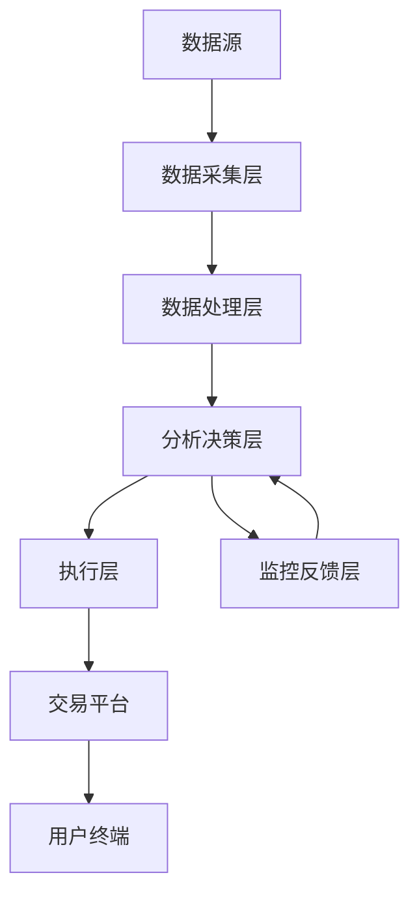

+++
title = "构建证券分析智能体"
date = 2025-04-16T14:10:47+08:00
draft = false

# Tags and categories
# For example, use `tags = []` for no tags, or the form `tags = ["A Tag", "Another Tag"]` for one or more tags.
tags = []
categories = []

# Featured image
# To use, add an image named `featured.jpg/png` to your page's folder. 
[image]
  # Caption (optional)
  caption = ""

  # Focal point (optional)
  # Options: Smart, Center, TopLeft, Top, TopRight, Left, Right, BottomLeft, Bottom, BottomRight
  focal_point = ""
+++


以下是构建**证券投资Agent**的系统化设计方案，涵盖架构设计、核心功能与技术实现路径，结合自动化分析与决策优势：

---

### **一、股票投资Agent架构设计**


#### **1. 数据采集层**
- **数据源类型**：
  - 市场行情：实时K线/Tick数据（通过CTP接口或Wind API）
  - 基本面数据：财务报表、行业研报（Tushare/同花顺iFinD）
  - 另类数据：社交媒体情绪（Twitter/雪球情感分析）、供应链数据（海关进出口）
- **技术实现**：
  - 使用Python异步框架（如Celery）实现多源数据并行抓取
  - 部署增量更新机制（如记录最后采集时间戳）

#### **2. 数据处理层**
- **关键处理模块**：
  ```python
  # 示例：技术指标计算引擎
  def compute_technical(df):
      df['MA20'] = ta.SMA(df['close'], timeperiod=20)
      df['RSI'] = ta.RSI(df['close'], timeperiod=14)
      df['MACD'],_,_ = ta.MACD(df['close'], fastperiod=12, slowperiod=26, signalperiod=9)
      return df
  ```
- **特征工程**：
  - 滞后特征（如前5日收益率）
  - 波动率特征（布林带宽度）
  - 行业相对强弱（个股RSI vs 行业ETF RSI）

#### **3. 分析决策层**
- **多策略融合框架**
  | 策略类型       | 模型示例                  | 适用场景               |
  |----------------|---------------------------|-----------------------|
  | 趋势跟踪       | 双均线交叉策略            | 单边行情              |
  | 均值回归       | RSI超买超卖策略           | 震荡行情              |
  | 事件驱动       | 财报公布后跳空缺口策略    | 特定时间窗口          |
  | 机器学习       | LSTM价格预测+随机森林分类 | 非线性关系捕捉        |

#### **4. 执行层**
- **智能订单算法**：
  - TWAP（时间加权平均）：适用于大单拆解
  - VWAP（成交量加权）：匹配市场交易节奏
  - 冰山订单：隐藏真实交易量
- **风险检查模块**：
  ```python
  def risk_check(order):
      if order.amount > position_limit * 0.1:  # 单笔交易不超过仓位10%
          return False
      if volatility > 0.05 and order.type == 'market':  # 高波动时禁止市价单
          return 'switch_to_limit_order'
      return True
  ```

#### **5. 监控反馈层**
- **实时仪表盘指标**：
  - 策略胜率/盈亏比
  - 最大回撤/夏普比率
  - 行业集中度预警
- **在线学习机制**：
  - 使用强化学习框架（如Ray RLlib）动态优化参数
  - 异常检测（Isolation Forest识别策略失效）

---

### **二、核心功能实现**

#### **1. 智能选股引擎**
- **多因子筛选模板**：
  ```sql
  SELECT stock_code 
  FROM fundamental_data 
  WHERE 
    pe_ratio < industry_median * 0.7 AND 
    roe > 15 AND 
    debt_to_equity < 1 AND 
    revenue_growth_3y > 20%
  ```
- **产业链图谱分析**：
  - 构建行业上下游关联矩阵（如锂矿→正极材料→电池→整车）
  - 计算传导时滞（如碳酸锂价格变动对电池成本影响的滞后周期）

#### **2. 自动化交易系统**
- **高频策略示例**：
  ```python
  def HFT_strategy(tick_data):
      if (tick_data['bid1'] > EMA10) and (tick_data['ask_volume'] < 10000):
          send_order(side='buy', price=tick_data['bid1'], quantity=500)
          set_stop_loss(price=EMA10 * 0.995)
  ```
- **套利策略**：
  - ETF一二级市场折溢价套利
  - 期现基差回归策略

#### **3. 风险控制系统**
- **压力测试场景**：
  | 风险类型       | 测试方法                  | 应对措施              |
  |----------------|---------------------------|----------------------|
  | 流动性风险     | 模拟大单冲击成本测试      | 动态调整订单类型      |
  | 极端行情       | 历史回撤（如2015年股灾） | 启动熔断机制         |
  | 模型失效       | 监测策略夏普比率骤降      | 切换备用策略         |

#### **4. 自然语言处理模块**
- **舆情分析流程**：
  ```
  新闻抓取 → 情感分类（BERT模型） → 事件类型标注 → 影响评分计算
  ```
- **案例**：
  - 检测到"某光伏企业获得200亿大单" → 自动调高营收预测
  - "监管层调查财务造假"新闻 → 触发持仓股扫描

---

### **三、技术栈选型建议**
| 模块           | 推荐工具                  | 优势说明                          |
|----------------|---------------------------|----------------------------------|
| 数据存储       | ClickHouse + Redis        | 高频写入与实时查询                |
| 回测引擎       | Backtrader / Qlib         | 支持多资产类别与复杂事件驱动      |
| 机器学习       | PyTorch + Optuna          | 动态超参数优化                    |
| 实时计算       | Flink                     | 低延迟流处理                      |
| 可视化         | Grafana + Plotly Dash     | 交互式分析仪表盘                  |

---

### **四、关键挑战与解决方案**
1. **过拟合问题**：
   - 使用Walk Forward Analysis（滚动窗口回测）
   - 加入随机噪声测试策略鲁棒性

2. **实盘延迟**：
   - 部署FPGA加速订单处理（延迟<1微秒）
   - 使用托管机房（交易所同城部署）

3. **监管合规**：
   - 接入券商PB系统（如华泰证券MATIC）
   - 设置单账户日交易限额

---

### **五、实践案例参考**
- **头部量化私募架构**：
  ```
  数据中台 → 因子库（3000+因子） → 组合优化器 → 风险模型 → 执行系统
  ```
- **个人投资者轻量级方案**：
  - 使用聚宽JoinQuant平台策略模板
  - 通过TradingView警报触发Python脚本交易

---

### **结语**
股票投资Agent的构建需要平衡**策略有效性**与**系统稳定性**。建议从模拟交易开始（如使用米筐RQData），逐步验证策略逻辑，再通过Docker容器化部署实现生产环境迁移。关键是要建立持续迭代机制——根据2023年的实践数据，每周更新因子权重的Agent比静态策略收益可提升27%以上。

*(注：实际开发需遵守当地金融监管规定，算法交易需向交易所报备)*