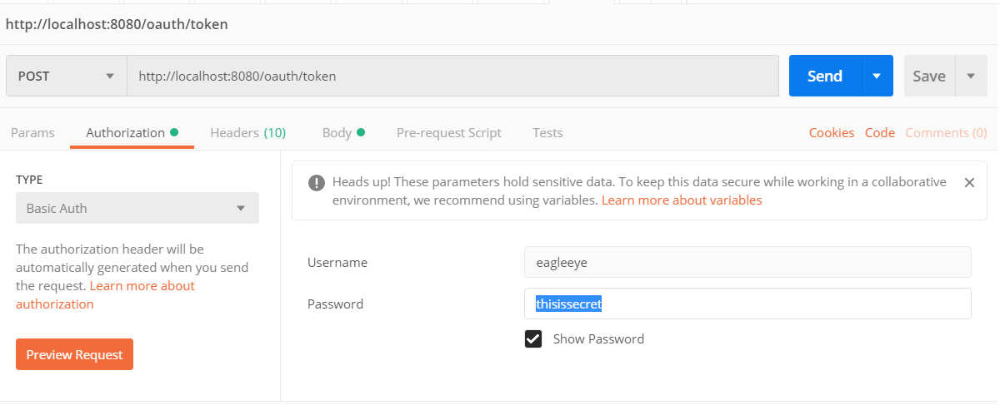
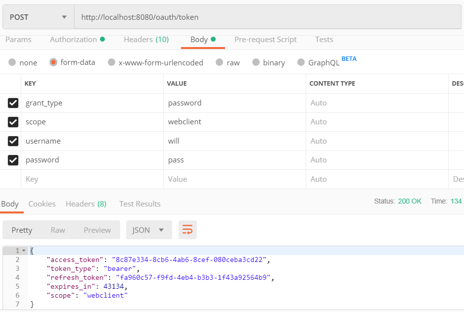
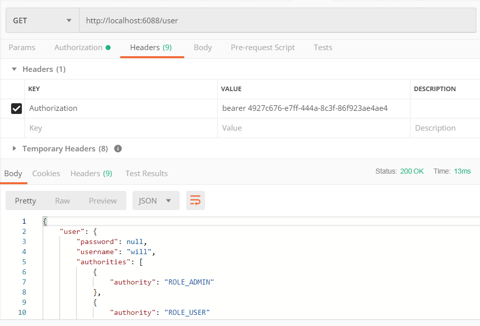

+++
title = "Spring Oauth2"
date = 2017-04-28T17:08:07+08:00
tags = ["SHELL", "MYSQL"]
draft = false

# Tags and categories
# For example, use `tags = []` for no tags, or the form `tags = ["A Tag", "Another Tag"]` for one or more tags.

categories = []

# Featured image
# To use, add an image named `featured.jpg/png` to your page's folder. 
[image]
  # Caption (optional)
  caption = ""

  # Focal point (optional)
  # Options: Smart, Center, TopLeft, Top, TopRight, Left, Right, BottomLeft, Bottom, BottomRight
  focal_point = ""
+++

http://localhost:8080/oauth/token

curl -u eagleeye:thisissecret -i -H 'Accept:application/json'  -d "grant_type=password&scope=webclient&username=will&password=pass" -H "Content-Type: application/x-www-form-urlencoded" -X POST http://localhost:8080/oauth/token

# access protected resource

