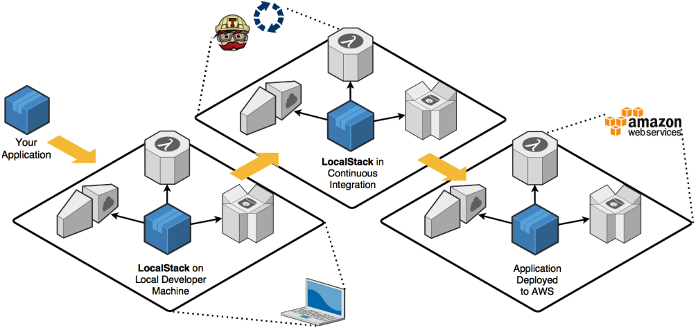

+++
title = "免费使用公有云服务"
date = 2019-09-12T07:46:24+08:00
draft = false

# Tags and categories
# For example, use `tags = []` for no tags, or the form `tags = ["A Tag", "Another Tag"]` for one or more tags.
tags = ["IAAS", "CLOUD", "LOCALSTACK", "AWS"]
categories = []

# Featured image
# To use, add an image named `featured.jpg/png` to your page's folder. 
[image]
  # Caption (optional)
  caption = ""

  # Focal point (optional)
  # Options: Smart, Center, TopLeft, Top, TopRight, Left, Right, BottomLeft, Bottom, BottomRight
  focal_point = ""
+++

[TOC]




AWS领先的设计理念和强大的技术生态

使你身陷其中，学习你要用它，开发你要

用它，上线还要用它。 一年下来项目还没有

正式商用，已经有十几万的研发费用。

今天向你推荐 localstack（与openstack啥关系？私有云+公有云），

让你使用AWS免费，至少在项目POC或开发测试阶段免费。

有了它， 你不用再焦急的等待老板审批公有云的

计算，存储，数据库资源开发申请。

是不是这个项目听起来很激动？ 


<!--
最近正在了解微服务编排相关技术规范，看看AWS Step Functions

如何设计的，localstack正好排上用场
-->

那如何使用localstack呢？


# 安装localstack

localstack是一个非常活跃的正在快速成长中的项目，

建议通过源代码安装

- 下载源代码

```
git clone git@github.com:localstack/localstack.git
git fetch --all
git checkout tags/v0.10.3 -b v0.10.3

```

- 启用需要使用的AWS服务

修改配置文件，启用你需要使用的AWS服务:ec2,s3,iot,kafka等。

注意服务的名字必须来自[服务名字列表](https://docs.aws.amazon.com/cli/latest/reference/#available-services)， 否则不识别


启用服务就是修改下边的配置文件


`localstack\docker-compose.yml`

```
 SERVICES=${SERVICES-ec2,ecs,stepfunctions,iam,lambda,dynamodb,apigateway,s3,sns}

 DATA_DIR=${DATA_DIR-/tmp/localstack/data }


 volumes:
      - "${TMPDIR:-d:/tmp/localstack}:/tmp/localstack"
```

**make sure driver D is shared in docker desktop daemon**


```
docker-compose up


localstack_1  | Starting mock S3 (http port 4572)...
localstack_1  | Starting mock SNS (http port 4575)...
localstack_1  | Starting mock IAM (http port 4593)...
localstack_1  | Starting mock API Gateway (http port 4567)...
localstack_1  | Starting mock DynamoDB (http port 4569)...
localstack_1  | Starting mock Lambda service (http port 4574)...
localstack_1  | Starting mock CloudWatch Logs (http port 4586)...
localstack_1  | Starting mock StepFunctions (http port 4585)...

```

系统消息显示需要的服务/端口已经启动。


到目前为至，localstack已经安装完毕。


# 记录并保存localstack的操作数据

 if volumes in  docker settings
 
 Localstack is recording all API calls in JSON file. 
 
 When the container restarts, it will re-apply these calls - 
 
 this is how we are able to keep our data between restarts

`docker-compose.yml`

```
- DATA_DIR=/tmp/localstack/data
```


下边，我们来验证公有云服务是否可用。


## 安装AWS客户端<a name="install_aws_sdk"></a>

- 安装到虚拟环境

```
(venv) d:\code\venv>pip install awscli

```

可以安装到系统环境

- 配置AWS CLI

```
(venv) d:\code\venv>aws configure

AWS Access Key ID [None]: any-id-is-ok
AWS Secret Access Key [None]: fake-key
Default region name [local]: local
Default output format [None]:

```


# 验证服务编排


- 试用stepfunctions服务

上面显示stepfunctions服务在4585端口，下面的端口要和

配置保持一致

```
(venv) d:\code\venv>aws stepfunctions --endpoint-url http://localhost:4585 list-activities

```


- 创建一个HelloWorld工作流

```

(venv) d:\code\venv>aws stepfunctions --endpoint-url http://localhost:4585 create-state-machine --definition "{\"Comment\": \"A Hello World example of the Amazon States Language using a Pass state\",\"StartAt\": \"HelloWorld\",\"States\": {\"HelloWorld\": {\"Type\": \"Pass\",\"End\": true}}}" --name "HelloWorld" --role-arn "arn:aws:iam::012345678901:role/DummyRole"

```

-  显示创建的工作流

```
(venv) d:\code\venv>aws stepfunctions --endpoint-url http://localhost:4585 list-state-machines
{
    "stateMachines": [
        {
            "creationDate": 1568199315.809,
            "stateMachineArn": "arn:aws:states:us-east-1:123456789012:stateMachine:HelloWorld",
            "name": "HelloWorld"
        }
    ]
}


```

工作流已经创建，你可以启动工作流，

添加Lambda，部署微服务，添加微服务到到工作流，

所有公有云的计算，存储，API调用，上行宽带费用

通过使用localstack一切免费。

赶快加入项目，贡献你的力量

https://localstack.cloud/


# 参考

- https://hub.docker.com/r/amazon/aws-stepfunctions-local
- https://docs.aws.amazon.com/lambda/latest/dg/limits.html

