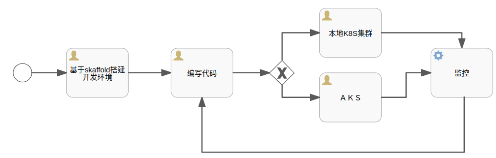
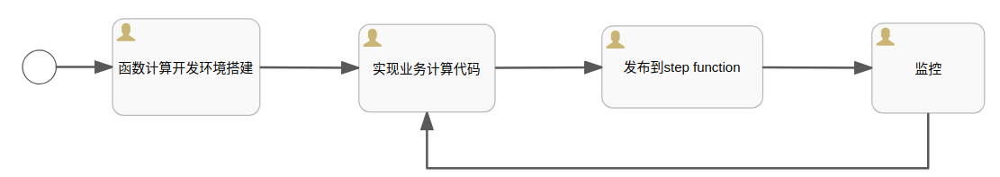
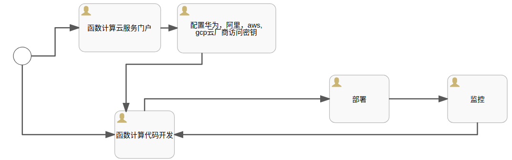

+++
title = "函数计算"
date = 2019-02-23T16:45:49+08:00
draft = false

# Tags and categories
# For example, use `tags = []` for no tags, or the form `tags = ["A Tag", "Another Tag"]` for one or more tags.
tags = []
categories = []

# Featured image
# To use, add an image named `featured.jpg/png` to your page's folder. 
[image]
  # Caption (optional)
  caption = ""

  # Focal point (optional)
  # Options: Smart, Center, TopLeft, Top, TopRight, Left, Right, BottomLeft, Bottom, BottomRight
  focal_point = ""
+++

## 前言

利用公有云或混合云的架构是企业IT应用落地实施的最高效方式。

企业在上云的过程中，主要面临以下问题：

- 公有云开发环境搭建：引起这个问题的主要原因有两个

  - 开发成本变化：固定成本变成线性成本
  - 网络带宽：宽带问题成为开发中的大难题

- 遗留应用迁移：公有云迁移并没有一个固定的方案，必须结合遗留应用的
  架构并结合公有云厂商的基础服务的特性采用最合理的有效方案。

- 应用架构的快速迭代：容器架构才刚刚落地， 函数计算又异军突起
  
## 内容

### WEB应用架构演进：虚机，容器，函数计算

- 微服务架构软件交付流程

- 函数计算架构软件交付流程

### 函数计算之道

  [函数计算进行时](/post/computing-in-function-way/)

### 公有云服务本地开发环境搭建

  开发者可以免费使用公有云服务进行开发测试

  [免费使用公有云服务](/post/use-public-cloud-for-free/)

### 函数计算本地开发环境搭建

  搭建一个完全本地的函数计算开发环境

  函数计算的本地开发环境搭建有两种方式：

- 基于localstack+terraform+serverless
  
  [开发环境本地搭建参考](/tags/serverless/)  

- 基于kubeless/knative+k8s
  
### 函数计算真实应用场景开发案例

  [函数计算应用案例](/tags/serverless/)

## 函数计算云服务

## 函数计算重要开发项目库

|   项目  |    平台 |  支持语言 |
:---|:---|:---
Zappa |  |python
Serverless | AWS Lambda, Azure Functions, Google CloudFunctions |Node.js, Python, Java, Go, C#, Ruby, Swift, Kotlin, PHP, Scala|
